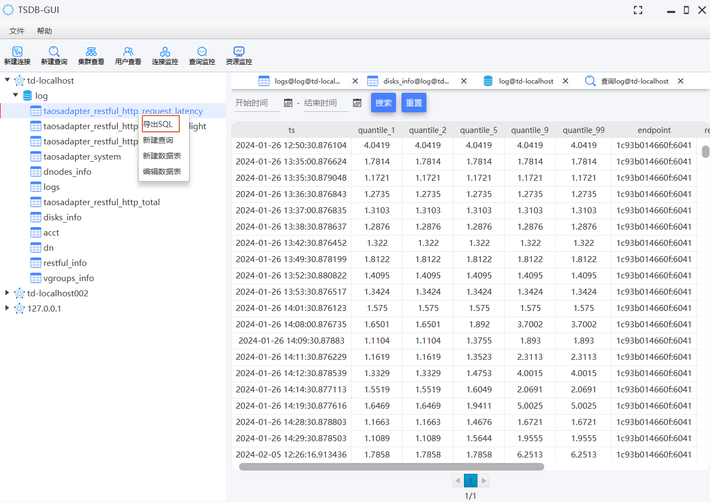

	

<h1 align="center" style="margin: 30px 0 30px; font-weight: bold;">Td-Genie v2.1.1</h1>

A free and open-source time-series database management tools for TDengine, offers a graphical user interface tool that provides users with an intuitive and easy-to-use experience for database management and operations!

----
English | [简体中文](README.md)

#### Description
Td-Genie is a comprehensive and easy-to-use graphical interface tool for TDengine time-series database. The current V2.1.1 version supports the following TDengine Server versions:

1. TDengine 2.x version (including 2.6.0.34, which has been tested)
2. TDengine 3.x version (including 3.2.3.0, which has been tested)
With this tool, users can enjoy a seamless and intuitive experience in managing and operating their TDengine databases.

Td-Genie's main features include:
1. Data Connection Management: Ability to add, modify, query, and delete data connections.
2. Database Maintenance: Capability to create, modify, query, and delete databases.
3. Super Table Maintenance: Functionality to create, modify, query, and delete super tables.
4. Super Table Data Query: Supports time-based queries and automatically displays data in paginated format.
5. Data Manipulation: Features to add, update, and copy field values, as well as copy as Insert statements.
6. Custom SQL Execution: Executes update or query SQLs, displaying results, execution time, and error information.
7. Resource Monitoring: Provides visibility into database CPU, memory, and disk usage trends.
8. DDL Export for Databases and Tables: Exports SQL scripts for database and table creation.
9. Cluster Overview: Displays information about data nodes and management nodes.
10. User Management: Viewing and managing user accounts.
11. Connection Monitoring: Monitors established connections.
12. Query Monitoring: Keeps track of actively executing query SQLs.

With these features, Td-Genie offers a comprehensive and user-friendly interface for managing and operating TDengine time-series databases, enhancing the overall database management experience.
#### Software Architecture

Using JavaFX to Implement UI Functions.

#### Installation

1.  Download the latest version from the distribution, extract it, and double-click the td-genie.exe file to execute it.(https://gitee.com/dbquery/td-genie/releases)

#### Instructions

1.  Initial interface

2.  创建连接(输入连接名称、IP、端口、用户名、密码)

3.  Create a connection (enter connection name, IP, port, username, password)

4.  Create a super table (input table name, field information)

5. View super table data (view all databases under the connection, all super tables under the database, support searching data in the super table by time, pagination query, and the ability to copy query results in the table)

6. New data (input fields and tag information)

7. Edit data (input field information)

8. Custom SQL execution (can execute any SQL, for query SQL, display query results, support saving SQL, beautifying SQL)

9. Resource monitoring and viewing (can view database CPU, memory, and disk usage trends)

10. Export Library Table DDL

11. Cluster view (viewing data nodes, managing nodes)

12. User View

13. Connection monitoring (monitoring established connections)

14. Query monitoring (monitoring executing query SQL)

####Contribution

Fork the repository
Create Feat_xxx branch
Commit your code
Create Pull Request
