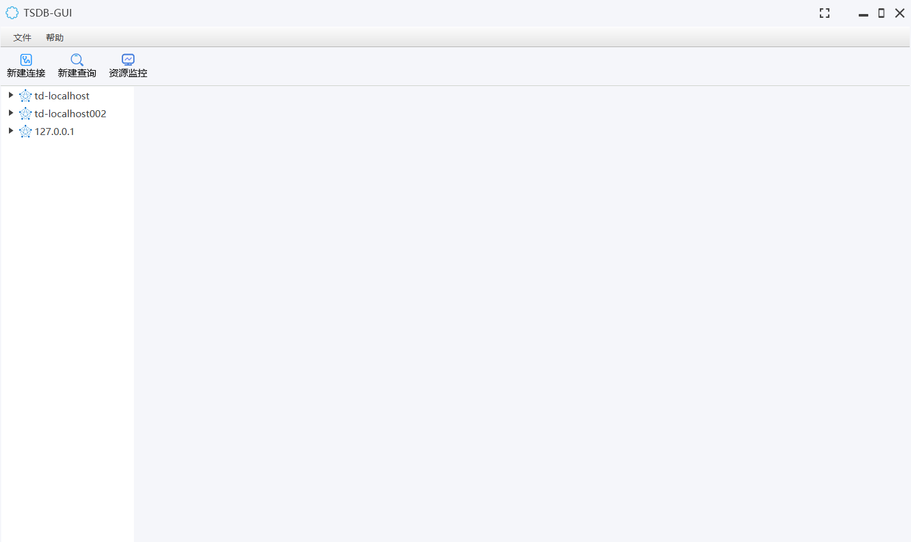

# tsdb-gui

#### 介绍
时序数据库图形用户界面工具，V1.0.0版本目前仅支持TDengine2.x版本，3.x版本以及其它时序数据库的支持，会在后续版本中实现。

#### 软件架构
基于JavaFX实现UI功能。

#### 安装教程

1.  下载解压，双击执行tsdb-gui.exe文件即可

#### 使用说明

1.  初始界面

2.  xxxx
3.  xxxx

#### 参与贡献

1.  Fork 本仓库
2.  新建 Feat_xxx 分支
3.  提交代码
4.  新建 Pull Request

