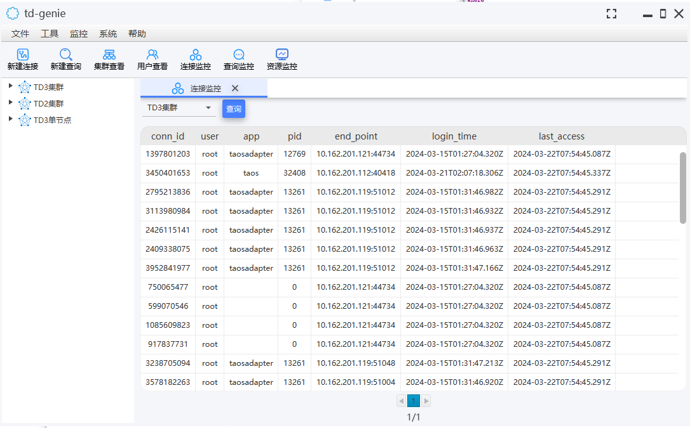
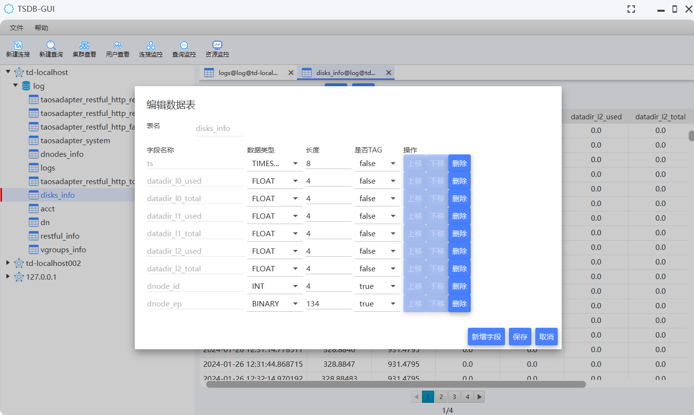
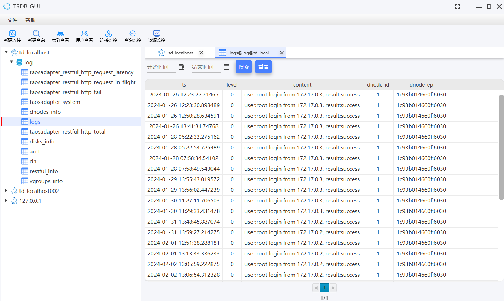
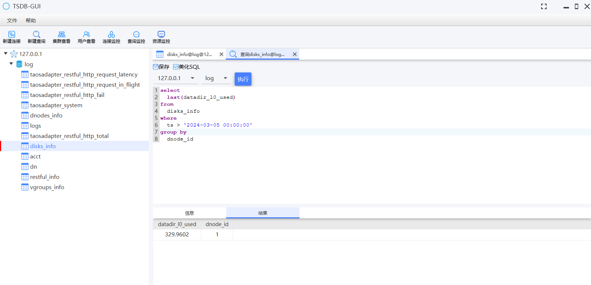

# tsdb-gui

#### 介绍
时序数据库图形用户界面工具，V1.0.0版本目前仅支持TDengine2.x版本，3.x版本以及其它时序数据库的支持，会在后续版本中实现。

#### 软件架构
基于JavaFX实现UI功能。

#### 安装教程

1.  下载解压，双击执行tsdb-gui.exe文件即可

#### 使用说明

1.  初始界面

2.  创建连接(输入连接名称、IP、端口、用户名、密码)

3.  创建数据库(输入数据库名、副本个数、数据保留天数、VNODE内存块数目、文件压缩标志位)

4.  创建超级表(输入表名称，字段信息)

5. 查看超级表数据（查看连接下的所有数据库、数据库下的所有超级表，支持按时间搜索超级表中数据，分页查询，可复制表格中的查询结果）

6. 自定义SQL执行(可执行任意SQL，对于查询SQL，可展示查询结果)

7. 资源监控查看(可查看CPU、内存、磁盘使用趋势)

#### 参与贡献

1.  Fork 本仓库
2.  新建 Feat_xxx 分支
3.  提交代码
4.  新建 Pull Request

