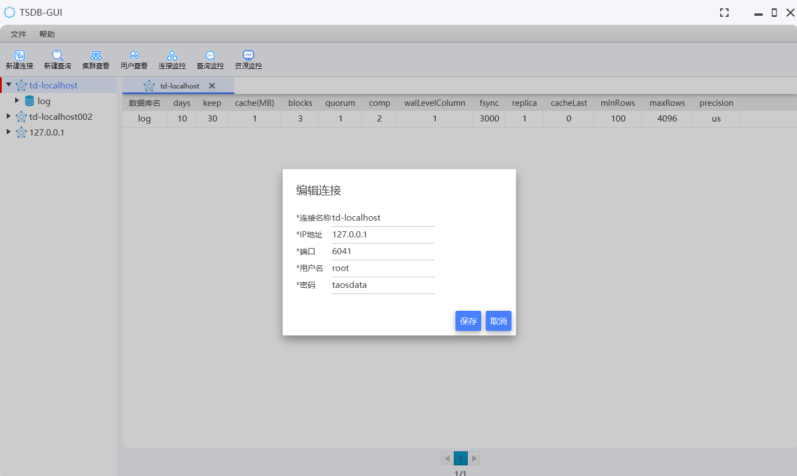
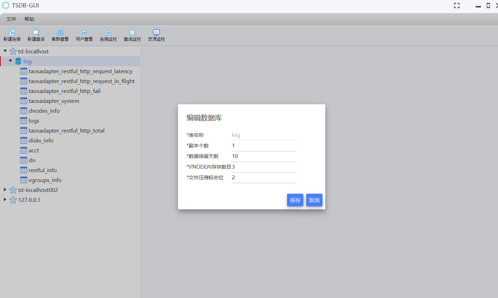
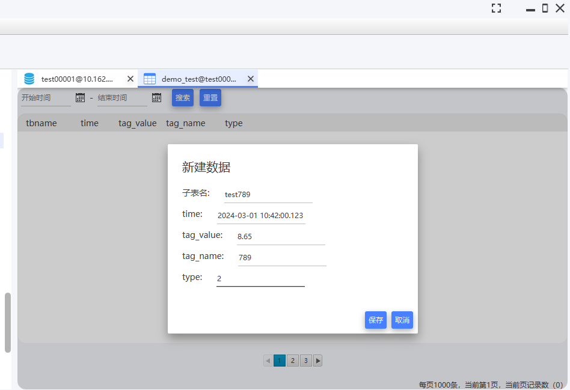
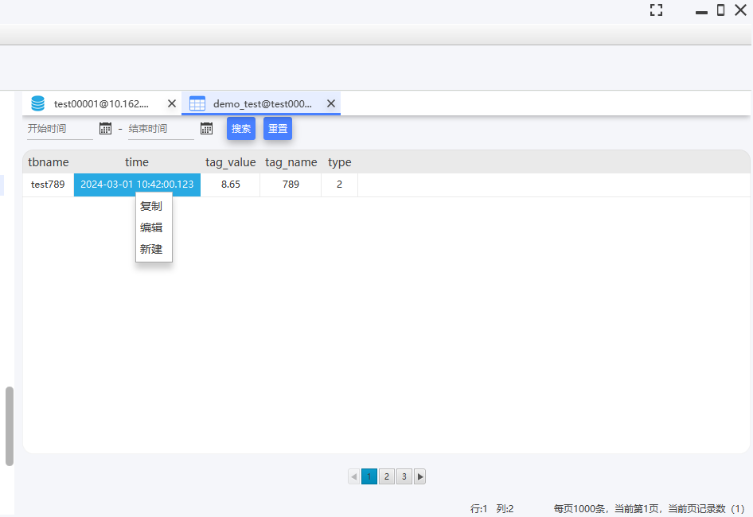
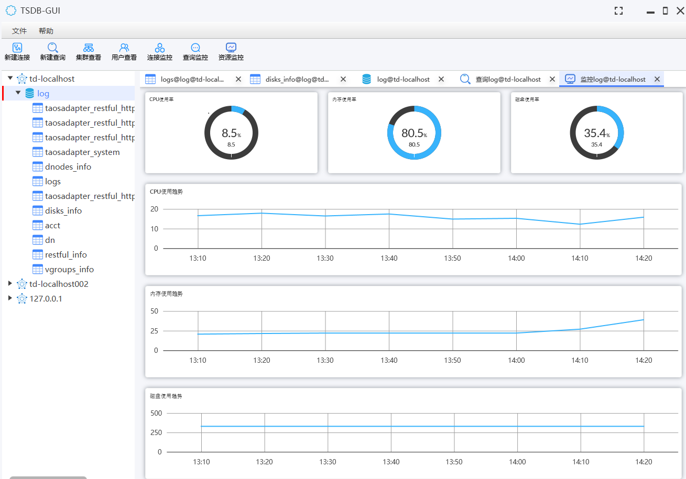

	

<h1 align="center" style="margin: 30px 0 30px; font-weight: bold;">Td-Genie v2.0.0</h1>
<h4 align="center">免费开源的TDengine时序数据库图形用户界面工具，为用户提供直观、易用的数据库管理和操作体验！</h4>

----

#### 介绍
Td-Genie是一款功能全面、操作简便的TDengine时序数据库图形界面工具，V2.0.0目前支持的TDengine Server版本列表如下：
1. TDengine2.x版本（2.6.0.34已测试）
2. TDengine3.x版本（3.2.3.0已测试）

主要功能：
1. 数据连接维护（新增、修改、查询、删除）
2. 数据库维护（新增、修改、查询、删除）
3. 超级表维护（新增、修改、查询、删除）
4. 超级表数据查询（支持按时间查询，自动分页展示）
5. 数据操作（新增、更新、复制）
6. 自定义SQL执行(可执行更新SQL或查询SQL，可展示查询结果、执行耗时、错误信息等) 
7. 资源监控查看(可查看数据库CPU、内存、磁盘使用趋势) 
8. 库表DDL导出（数据库创建SQL、表创建SQL）
#### 软件架构
基于JavaFX实现UI功能。

#### 安装教程

1.  从发行版中下载最新版本，解压，双击执行td-genie.exe文件即可(https://gitee.com/dbquery/td-genie/releases)

#### 使用说明

1.  初始界面

2.  创建连接(输入连接名称、IP、端口、用户名、密码)

3.  创建数据库(输入数据库名、副本个数、数据保留天数、VNODE内存块数目、文件压缩标志位)

4.  创建超级表(输入表名称，字段信息)

5. 查看超级表数据（查看连接下的所有数据库、数据库下的所有超级表，支持按时间搜索超级表中数据，分页查询，可复制表格中的查询结果）

6. 新增数据（输入字段和Tag信息）

7. 编辑数据 (输入字段信息)

8. 自定义SQL执行(可执行任意SQL，对于查询SQL，可展示查询结果，支持保存SQL、美化SQL)

9. 资源监控查看(可查看数据库CPU、内存、磁盘使用趋势)

10. 导出库表DDL

#### 参与贡献

1.  Fork 本仓库
2.  新建 Feat_xxx 分支
3.  提交代码
4.  新建 Pull Request
